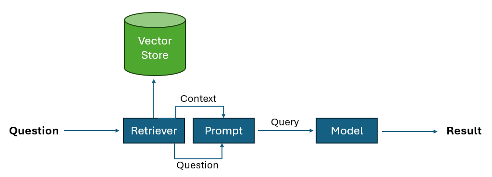

# 📄 PDF-QnA-E2E-RAG-System-on-Amazon-Bedrock

An end-to-end **Retrieval-Augmented Generation (RAG)** system built on **Amazon Bedrock** to answer natural language questions from a PDF document. This project intelligently extracts relevant content from PDFs and uses foundation models to generate accurate, context-aware responses.

---

## 🚀 Features

- 🔍 Semantic search on PDF documents  
- 🧠 Contextual response generation using foundation models via Amazon Bedrock  
- 📦 Clean modular design for easy experimentation  
- 💡 Streamlit-based interactive demo interface  

---

## 🧱 System Architecture

The diagram below illustrates the high-level structure of the system:



Diagram Flow:

[ PDF File ] 
     |
     v
[ Text Extraction (PyPDF) ]
     |
     v
[ Chunking (LangChain) ]
     |
     v
[ Embedding (Bedrock Embedding Model) ]
     |
     v
[ Vector Store (FAISS) ]
     |
     v
[ Retriever (LangChain) ]
     |
     v
[ Prompt + Retrieved Chunks ]
     |
     v
[ Amazon Bedrock (LLM) ]
     |
     v
[ Final Answer ]
     |
     v
[ Streamlit UI ]

---

## 🛠️ Getting Started

### 1. Clone the Repository

```bash
git clone https://github.com/mahdimirmojarabian/PDF-QnA-E2E-RAG-System-on-Amazon-Bedrock.git
cd PDF-QnA-E2E-RAG-System-on-Amazon-Bedrock
```

### 2. Set Up a Virtual Environment

```bash
python -m venv rag_bedrock
```

Activate the environment:

- **Linux/macOS**:

  ```bash
  source rag_bedrock/bin/activate
  ```

- **Windows**:

  ```bash
  rag_bedrock\Scripts\activate
  ```

### 3. Install Dependencies

```bash
pip install -r requirements.txt
```

---

## 🔐 AWS Configuration

### 4. Install AWS CLI

Follow the official guide to install the AWS CLI:  
👉 [Install AWS CLI](https://docs.aws.amazon.com/cli/latest/userguide/getting-started-install.html)

### 5. Configure AWS Credentials

Run the following command and provide your credentials:

```bash
aws configure
```

Make sure your IAM role has permissions to access Amazon Bedrock and related services.

---

## 🎯 Running the Application

### Streamlit Demos

You can run two different Streamlit apps based on your needs:

#### 🧪 Test Bedrock Connectivity (Simple Chatbot)

Use this to verify your Bedrock setup and test simple prompt-response interactions with the model:

```bash
streamlit run bedrock_test.py
```

#### 🚀 Launch Full RAG Application

This runs the complete end-to-end Retrieval-Augmented Generation system for PDF-based Q&A:

```bash
streamlit run rag_demo.py
```

---

## 📚 Use Cases

- Internal document Q&A systems  
- Customer support knowledge base integration  
- Legal and compliance document summarization  
- Academic and research assistance  

---

## 🧠 Powered By

- **Amazon Bedrock**  
- **LangChain / FAISS**  
- **Streamlit**  
- **Python 3.8+**

---

## 📬 Contact

For questions, suggestions, or contributions, feel free to open an issue or contact me on [LinkedIn](https://www.linkedin.com/in/m-mahdi-mir).
